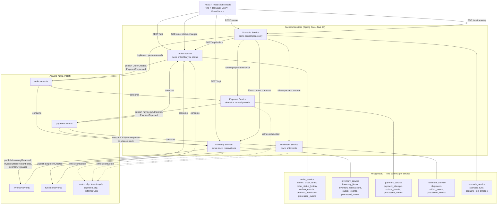
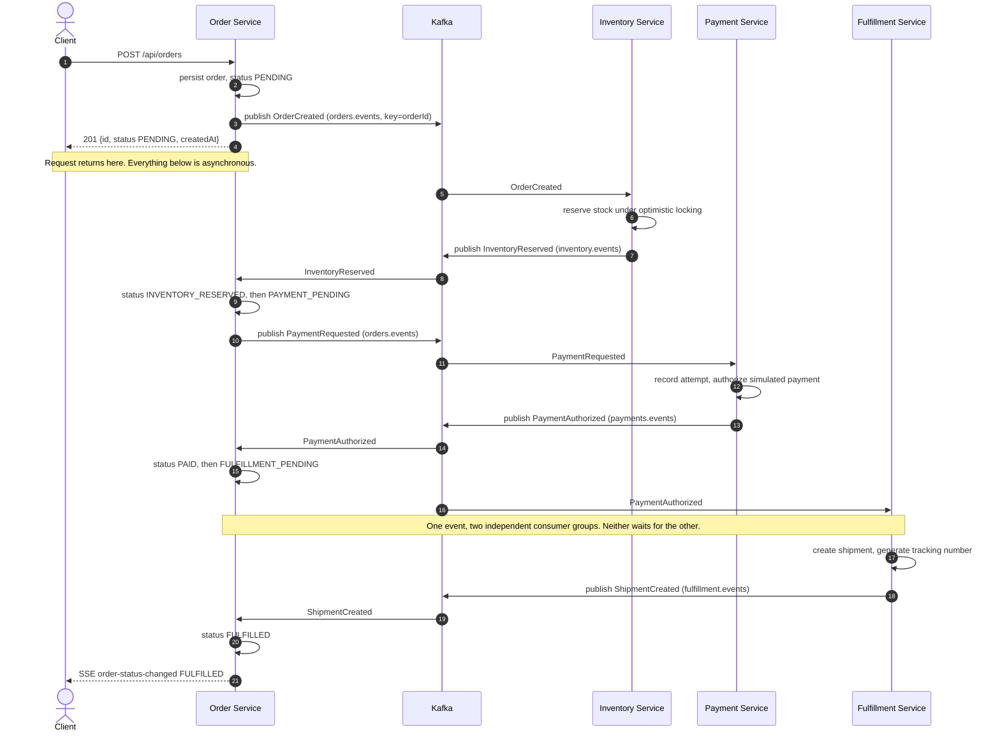
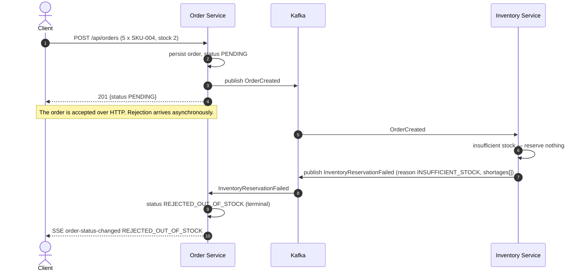
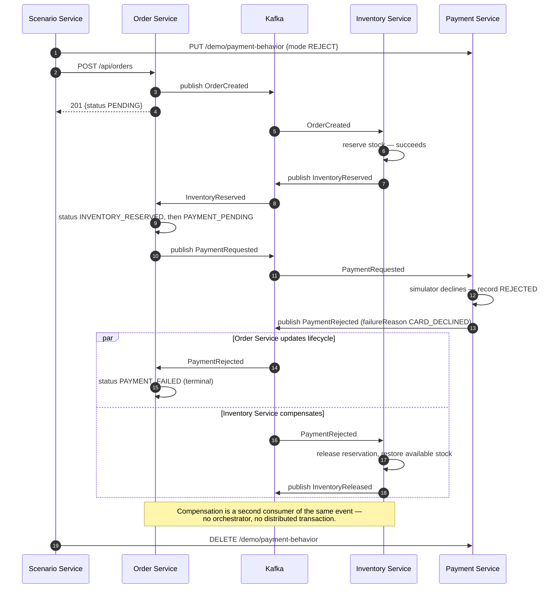

# Architecture Diagram

Diagrams render natively on GitHub (Mermaid). Sources of truth for the details behind them:
`docs/events/event-catalog.md` (events, topics, publishers/consumers),
`docs/order-state-machine.md` (statuses), `docs/db-ownership.md` (tables),
`docs/scenarios.md` (demo scenarios).

Everything drawn here is the **Phase 3+ target**: four business services plus a Scenario Service,
each with its own schema, communicating through Kafka. Phase 1 is the same domain logic as in-process
modules with no Kafka, and Phase 2 adds Kafka while still deploying as one application
(`docs/planning/sprint-1/implementation-phases.md`).

---

## 1. System overview

Three things the diagram is meant to make obvious:

- **No arrow between two business services.** Order, Inventory, Payment, and Fulfillment communicate
  only through Kafka. The only synchronous service-to-service arrows come from Scenario Service, and
  they are demo control, not workflow (ADR-002).
- **Each service touches exactly one schema.** No shared tables, no cross-schema reads (ADR-004).
- **A service publishes only to its own topic.** `PaymentRequested` sits on `orders.events` because
  Order Service publishes it (`docs/events/event-catalog.md` §2).

One thing the diagram deliberately does not show, because it is a deployment property rather than an
architectural one: locally the browser reaches five services on five origins
(`localhost:8081`–`8085`), while the public demo puts all of them behind a single hostname with
`/svc/{service}/...` path prefixes. The arrows are the same either way. What changes is that in
production the **only** routed paths are the `UI -->` arrows above — the `SCN -->` arrows into
Payment, Inventory and Fulfillment stay cluster-internal and are unreachable from outside, which is
what keeps a visitor from pausing a consumer or forcing payment rejections directly. See
`infrastructure/kubernetes/production/common/ingress.yaml` and ADR-010.

---

## 2. Happy path — order reaches `FULFILLED`

Scenario 1 (`POST /demo/scenarios/standard-order`). The HTTP response returns long before the
workflow finishes, which is the point.

---

## 3. Inventory failure path — order reaches `REJECTED_OUT_OF_STOCK`

Scenario 2 (`POST /demo/scenarios/out-of-stock`). A business rejection: nothing is retried, nothing is
dead-lettered, and there is nothing to compensate because no stock was ever held.

Reservation is all-or-nothing per order: a partially satisfiable order fails whole rather than
reserving a subset of its lines.

---

## 4. Payment failure path — order reaches `PAYMENT_FAILED`, stock released

Scenario 3 (`POST /demo/scenarios/payment-failure`). This is the compensation path — the closest thing
to a saga in the project, without an orchestration framework.

A **retryable** simulated provider error is a different path and must not be confused with this one:
it raises inside the Payment Service consumer, is retried with backoff, and lands in `payments.dlq` if
attempts are exhausted — leaving the order in `PAYMENT_PENDING` rather than `PAYMENT_FAILED`
(`docs/events/event-catalog.md`, `PaymentRejected`).

---

## 5. Delivery and consistency properties

Stated plainly so no diagram above is read as promising more than the implementation provides
(`docs/planning/agent-guidance.md` rule 18):

- **At-least-once delivery.** Consumers may see any record more than once and are made idempotent
  through a per-service `processed_events` ledger (ADR-005). This project does **not** implement
  exactly-once semantics.
- **Per-partition ordering only.** `orderId` is the record key, so one order's events keep their
  relative order. Nothing guarantees ordering across orders.
- **Eventual consistency across services.** An order can be `PAID` for a few milliseconds before a
  shipment exists. Every read is a snapshot of one service's view.
- **No dual-write window remains in any of the four services.** Order Service closed this first, in
  Phase 6 (ADR-006); Sprint 2 closed it in Inventory, Payment and Fulfillment Service too. Every
  event each service produces is written to that service's own `outbox_events` row in the same
  transaction as the business change it describes, and a background publisher per service sends the
  row and marks it published. That makes publication durable, not exactly-once: a crash between the
  send and the mark resends the row, which the idempotent consumers above absorb.
- **Order Service's own aggregate status is guarded against cross-topic reordering (ADR-009).**
  `PaymentAuthorized` (`payments.events`) and `ShipmentCreated` (`fulfillment.events`) are consumed
  by Order Service on independent listeners with no ordering guarantee between the two topics, and
  under load the later-in-the-workflow event can be processed first. Order Service now classifies
  every write against `docs/order-state-machine.md`'s frozen transition table before applying it: a
  transition that arrives too early is parked in `deferred_transitions` and applied once its
  predecessor lands, and a transition the order has already passed is dropped. The result —
  `orders.status` only ever holds a status reachable by a valid transition sequence, and never
  reverts out of a terminal state — is a real, tested guarantee (an integration test reproduces the
  original race deterministically), not merely a documentation intent. It does not make delivery
  exactly-once; it makes the aggregate's *observed* status sequence always valid even though the
  underlying events can still arrive out of order.

---

## 6. Scaling

`docs/agent-reports/sprint-1/phase-10-scaling-demo.md` first showed this system's horizontal-scaling
story by hand: `kubectl scale deployment/inventory-service --replicas=N` against Scenario 8
("High-Volume Batch," `docs/scenarios.md`), and measured its limits — the local `kind` Docker
Desktop VM's ~3.8GB ceiling meant 3 replicas of Inventory Service alongside the rest of the 8-pod
stack pushed the node into CPU/memory contention and Kafka readiness-probe flapping before any
scenario load was even applied.

Inventory Service is Scenario 8's consumer group: every `OrderCreated` on `orders.events` triggers a
reservation write, so it's the service that visibly saturates under that scenario's burst. It's also
the natural ceiling case for *this* topic: `orders.events` has a fixed 3-partition count
(`docs/db-ownership.md`), and a Kafka consumer group can never usefully run more consumers than
partitions — a 4th replica would sit idle.

A `HorizontalPodAutoscaler` (`infrastructure/kubernetes/10-inventory-service-hpa.yaml`) now formalizes
that manual story: `minReplicas: 1`, `maxReplicas: 3`, targeting 65% average CPU utilization against
Inventory Service's 150m request, fed by `metrics-server`
(`infrastructure/kubernetes/11-metrics-server.yaml`, `kind` only — the production overlay relies on
k3s's own bundled metrics-server instead, see that overlay's `kustomization.yaml`). A fast scale-up
policy (no stabilization delay) and a 2-minute scale-down stabilization window keep a burst's scale-up
responsive without the HPA flapping a pod in and out right after the burst clears.

Verified for real on the Hetzner dev box (`infrastructure/dev-box/`, more CPU/memory headroom than the
laptop's Docker Desktop VM) running Scenario 8 against a live `kind` cluster — real `kubectl get hpa` /
`kubectl describe hpa` output, not a hypothetical: CPU utilization crossed the 65% target after the
burst's submitted orders started draining, the HPA rescaled Inventory Service from 1 to 2 replicas
(`SuccessfulRescale ... New size: 2; reason: cpu resource utilization (percentage of request) above
target`), and once the backlog drained and utilization stayed low past the stabilization window it
scaled back down to 1 (`SuccessfulRescale ... New size: 1; reason: All metrics below target`). Full
transcript and analysis in `docs/agent-reports/sprint-2/hpa-scaling-demo.md`.
