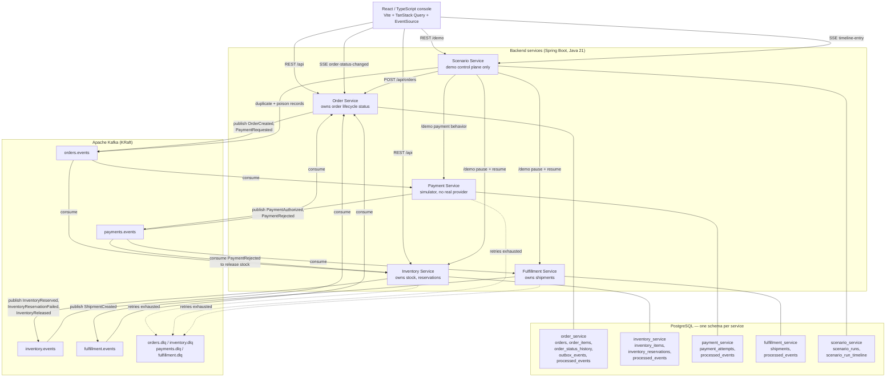
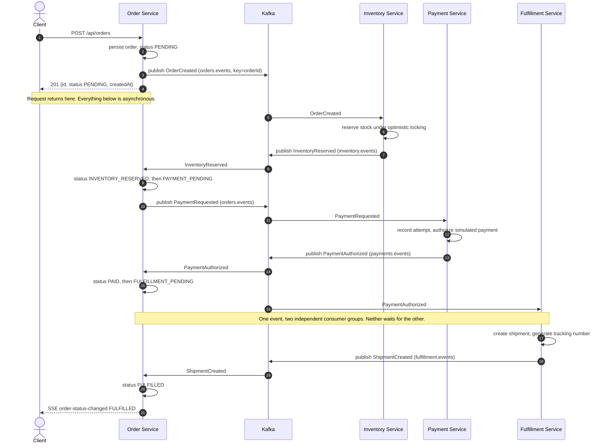
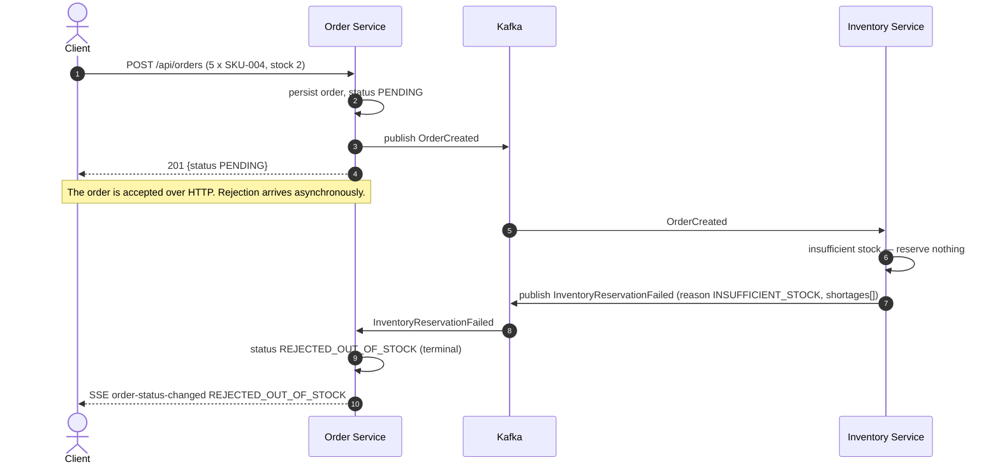
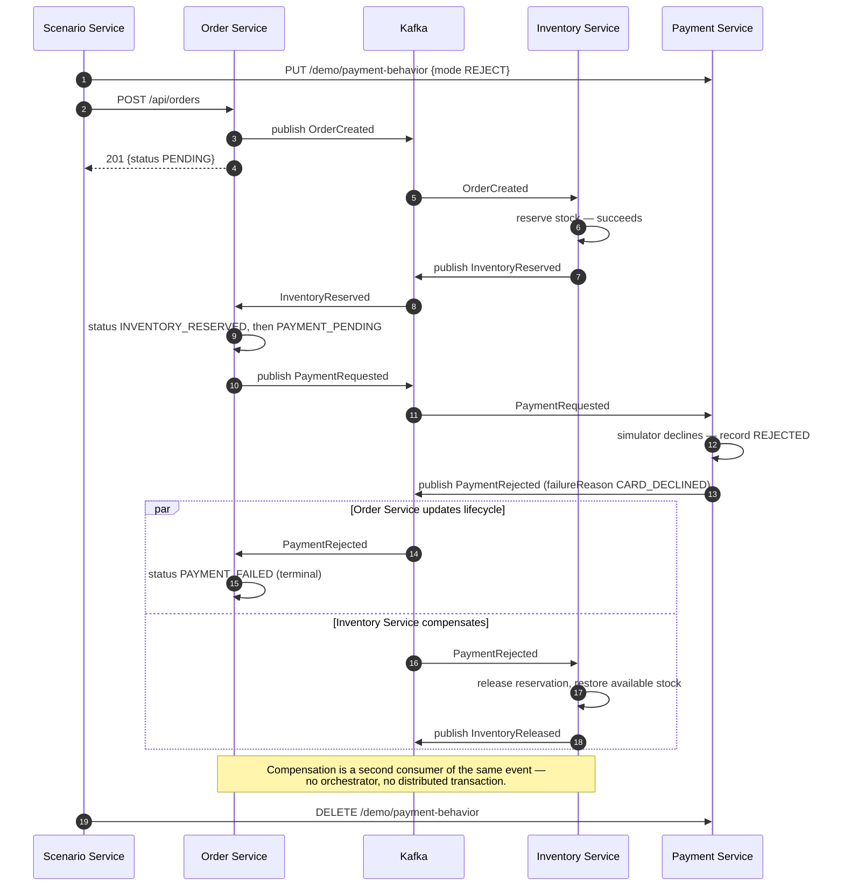

# Architecture Diagram

Diagrams render natively on GitHub (Mermaid). Sources of truth for the details behind them:
`docs/events/event-catalog.md` (events, topics, publishers/consumers),
`docs/order-state-machine.md` (statuses), `docs/db-ownership.md` (tables),
`docs/scenarios.md` (demo scenarios).

Everything drawn here is the **Phase 3+ target**: four business services plus a Scenario Service,
each with its own schema, communicating through Kafka. Phase 1 is the same domain logic as in-process
modules with no Kafka, and Phase 2 adds Kafka while still deploying as one application
(`docs/planning/implementation-phases.md`).

---

## 1. System overview

Three things the diagram is meant to make obvious:

- **No arrow between two business services.** Order, Inventory, Payment, and Fulfillment communicate
  only through Kafka. The only synchronous service-to-service arrows come from Scenario Service, and
  they are demo control, not workflow (ADR-002).
- **Each service touches exactly one schema.** No shared tables, no cross-schema reads (ADR-004).
- **A service publishes only to its own topic.** `PaymentRequested` sits on `orders.events` because
  Order Service publishes it (`docs/events/event-catalog.md` §2).

---

## 2. Happy path — order reaches `FULFILLED`

Scenario 1 (`POST /demo/scenarios/standard-order`). The HTTP response returns long before the
workflow finishes, which is the point.

---

## 3. Inventory failure path — order reaches `REJECTED_OUT_OF_STOCK`

Scenario 2 (`POST /demo/scenarios/out-of-stock`). A business rejection: nothing is retried, nothing is
dead-lettered, and there is nothing to compensate because no stock was ever held.

Reservation is all-or-nothing per order: a partially satisfiable order fails whole rather than
reserving a subset of its lines.

---

## 4. Payment failure path — order reaches `PAYMENT_FAILED`, stock released

Scenario 3 (`POST /demo/scenarios/payment-failure`). This is the compensation path — the closest thing
to a saga in the project, without an orchestration framework.

A **retryable** simulated provider error is a different path and must not be confused with this one:
it raises inside the Payment Service consumer, is retried with backoff, and lands in `payments.dlq` if
attempts are exhausted — leaving the order in `PAYMENT_PENDING` rather than `PAYMENT_FAILED`
(`docs/events/event-catalog.md`, `PaymentRejected`).

---

## 5. Delivery and consistency properties

Stated plainly so no diagram above is read as promising more than the implementation provides
(`docs/planning/agent-guidance.md` rule 18):

- **At-least-once delivery.** Consumers may see any record more than once and are made idempotent
  through a per-service `processed_events` ledger (ADR-005). This project does **not** implement
  exactly-once semantics.
- **Per-partition ordering only.** `orderId` is the record key, so one order's events keep their
  relative order. Nothing guarantees ordering across orders.
- **Eventual consistency across services.** An order can be `PAID` for a few milliseconds before a
  shipment exists. Every read is a snapshot of one service's view.
- **A dual-write window still exists in three of the four services.** Inventory, Payment and
  Fulfillment Service persist and then publish, so a crash in between loses the event. Order Service
  closed this in Phase 6 (ADR-006): both events it produces — `OrderCreated` and `PaymentRequested` —
  are written to an `outbox_events` row in the same transaction as the business change, and a
  background publisher sends them and marks them published. That makes Order Service's publication
  durable, not exactly-once: a crash between the send and the mark resends the row, which the
  idempotent consumers above absorb.
