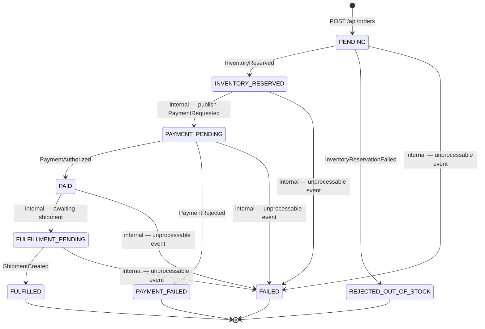

# Order State Machine

**Status:** frozen by Phase 0. This is the authoritative order status enum and transition set for
every service, test, and UI string. Draft source: `docs/planning/sprint-1/backend-design.md`'s Suggested Order
States section (which this formalizes rather than redesigns).

Order status is owned exclusively by **Order Service** (`orders.status`). No other service writes it.
Inventory, Payment, and Fulfillment own their own local statuses — `inventory_reservations.status`,
`payment_attempts.status`, `shipments.status` — which are separate and must not be confused with
order status. See `docs/db-ownership.md`.

---

## 1. States

| State | Terminal | Meaning |
|---|---|---|
| `PENDING` | no | Order accepted and persisted by `POST /api/orders`; `OrderCreated` published. Nothing has been reserved or charged. |
| `INVENTORY_RESERVED` | no | Every line is reserved against stock. Payment not yet requested. |
| `REJECTED_OUT_OF_STOCK` | **yes** | At least one line could not be reserved. No payment was attempted; nothing to compensate. |
| `PAYMENT_PENDING` | no | `PaymentRequested` published; awaiting the payment simulator's outcome. |
| `PAID` | no | Payment authorized. Fulfillment has not yet been recorded as pending. |
| `PAYMENT_FAILED` | **yes** | Payment was declined. Inventory Service releases the reservation as compensation (`InventoryReleased`). |
| `FULFILLMENT_PENDING` | no | Payment is authorized and a shipment is expected. |
| `FULFILLED` | **yes** | A shipment exists. The happy path's terminal state. |
| `FAILED` | **yes** | The order cannot progress because one of its events could not be processed (non-retryable failure, or retries exhausted into a DLQ). Distinct from the two business rejections above: those are expected outcomes, this is a fault. |

### On `REJECTED_OUT_OF_STOCK` vs `OUT_OF_STOCK`

The planning docs are internally inconsistent here, and Phase 0 froze the name rather than leaving
both in circulation:

- `docs/planning/sprint-1/backend-design.md`'s Suggested Order States list says `OUT_OF_STOCK`.
- `docs/planning/sprint-1/backend-design.md`'s failed-inventory flow diagram says `REJECTED_OUT_OF_STOCK`.
- `docs/planning/sprint-1/frontend-design.md`'s Scenario 2 gives `REJECTED_OUT_OF_STOCK` as the expected
  terminal state.

**`REJECTED_OUT_OF_STOCK` is the frozen value.** It matches two of the three references, including
the one the UI and the Scenario 2 integration test assert against. The planning docs were not edited;
this is reported in `docs/agent-reports/phase-0.md`.

---

## 2. Diagram

---

## 3. Transitions

Every transition is either **event-caused** (Order Service consumed the named event from
`docs/events/event-catalog.md`) or **internal** (Order Service moved the order itself, with no
inbound event). Internal transitions are called out explicitly because they are the ones a reader
would otherwise expect to find an event for.

| # | From | To | Cause | Kind |
|---|---|---|---|---|
| 1 | *(none)* | `PENDING` | `POST /api/orders` succeeded and the order was persisted. `OrderCreated` is published as part of this step. | REST |
| 2 | `PENDING` | `INVENTORY_RESERVED` | `InventoryReserved` | event |
| 3 | `PENDING` | `REJECTED_OUT_OF_STOCK` | `InventoryReservationFailed` | event |
| 4 | `INVENTORY_RESERVED` | `PAYMENT_PENDING` | Order Service publishes `PaymentRequested` | internal |
| 5 | `PAYMENT_PENDING` | `PAID` | `PaymentAuthorized` | event |
| 6 | `PAYMENT_PENDING` | `PAYMENT_FAILED` | `PaymentRejected` | event |
| 7 | `PAID` | `FULFILLMENT_PENDING` | Order Service records that a shipment is outstanding | internal |
| 8 | `FULFILLMENT_PENDING` | `FULFILLED` | `ShipmentCreated` | event |
| 9 | any non-terminal | `FAILED` | Non-retryable processing failure for one of the order's events, or retries exhausted and the record routed to a DLQ | internal |

Any transition not listed above is invalid and must be rejected by the domain model, not silently
applied. In particular: no transition leaves a terminal state, and a redelivered event whose
transition has already been applied is a no-op (the idempotency check in
`docs/planning/sprint-1/backend-design.md`'s Idempotent consumers section runs before the transition, so
Scenario 4's duplicate produces no second history row).

Every transition writes one `order_status_history` row, carrying `source_event_id` — the envelope
`eventId` for event-caused transitions, and null for transitions 1, 4, 7, and 9, which no inbound
event caused.

### Notes on the internal transitions

**Transition 4 (`INVENTORY_RESERVED` → `PAYMENT_PENDING`).** The planning docs define this edge but
name no event for it, because the event it produces (`PaymentRequested`) is *outbound*, not inbound.
Order Service applies the state change and publishes the event in one transaction.

**Transition 7 (`PAID` → `FULFILLMENT_PENDING`).** The docs also name no event here, and there is
none available: Fulfillment Service consumes `PaymentAuthorized` directly, so Order Service never
sends it a request. Both states are in the frozen state list, and one event (`PaymentAuthorized`)
therefore drives two consecutive transitions in the same Order Service handler — `PAID` records the
payment outcome, `FULFILLMENT_PENDING` records that a shipment is outstanding. `PAID` is consequently
short-lived and will rarely be observed by the UI. A `FulfillmentRequested` event would make this
edge event-driven, and was rejected for contradicting
`docs/planning/sprint-1/backend-design.md` 4.4 — see `docs/events/event-catalog.md` §4.

**Transition 9 (→ `FAILED`).** `FAILED` appears in the frozen state list with no transitions defined
into it at all. It is formalized here as the fault outcome — reachable from any non-terminal state
when one of the order's events cannot be processed (Scenario 6's poison message being the
demonstrable case). No domain event in `docs/events/event-catalog.md` causes it; it is driven by the
consumer's error handling. This is the one state in this document whose entry condition Phase 0
supplied rather than formalized, and it is reported as such in
`docs/agent-reports/phase-0.md`.

---

## 4. Consistency checks

### Every state is reachable

| State | Reached by |
|---|---|
| `PENDING` | transition 1 |
| `INVENTORY_RESERVED` | transition 2 |
| `REJECTED_OUT_OF_STOCK` | transition 3 |
| `PAYMENT_PENDING` | transition 4 |
| `PAID` | transition 5 |
| `PAYMENT_FAILED` | transition 6 |
| `FULFILLMENT_PENDING` | transition 7 |
| `FULFILLED` | transition 8 |
| `FAILED` | transition 9 |

All 9 states reachable; all 4 terminal states are reachable from at least one non-terminal state.

### Every status-changing event in the catalog is accounted for

| Event | Status effect | Transition |
|---|---|---|
| `OrderCreated` | none — published while entering `PENDING` | part of 1 |
| `InventoryReserved` | `PENDING` → `INVENTORY_RESERVED` | 2 |
| `InventoryReservationFailed` | `PENDING` → `REJECTED_OUT_OF_STOCK` | 3 |
| `PaymentRequested` | `INVENTORY_RESERVED` → `PAYMENT_PENDING` (as publisher) | 4 |
| `PaymentAuthorized` | `PAYMENT_PENDING` → `PAID` → `FULFILLMENT_PENDING` | 5, 7 |
| `PaymentRejected` | `PAYMENT_PENDING` → `PAYMENT_FAILED` | 6 |
| `ShipmentCreated` | `FULFILLMENT_PENDING` → `FULFILLED` | 8 |
| `InventoryReleased` | none — inventory-side compensation only | — |

All 8 catalogued events accounted for. The two with no status effect (`OrderCreated`,
`InventoryReleased`) are listed explicitly so that "missing from the transition table" cannot be
mistaken for an oversight.
